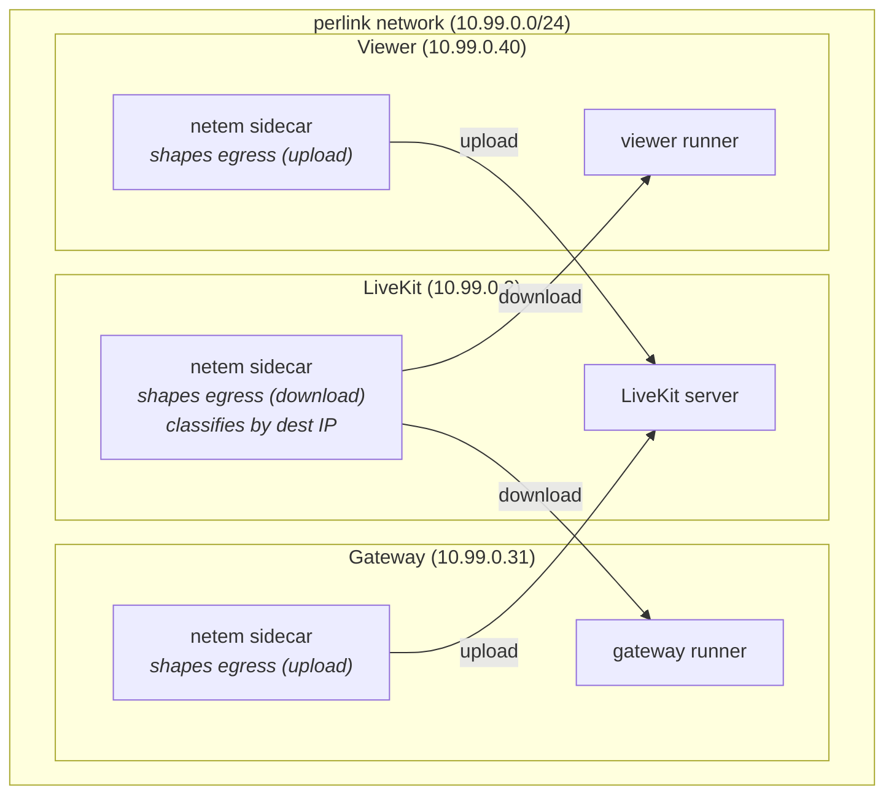

# Network impairment testing

Simulate degraded network conditions between the SDK gateway, LiveKit, and the Foxglove app viewer. Each link can be impaired independently to model real-world asymmetric networks.

## Architecture



**Traffic flow (gateway example):**

- gateway → LiveKit: runner sends, passes through gateway netem sidecar egress (upload shaping)
- LiveKit → gateway: LiveKit sends, passes through LiveKit netem sidecar egress, classified to gateway class (download shaping)

## Quick start (flat mode)

Run the test card on the host with uniform impairment on all traffic:

```sh
# Terminal 1: start LiveKit + netem
yarn start-netem

# Terminal 2: start the Foxglove app (if not already running)
(cd ../app && docker compose up -d && yarn start)

# Terminal 3: start the web frontend
(cd ../app && yarn web serve:local)

# Terminal 4: run the test card
FOXGLOVE_API_URL=http://localhost:3000/api \
FOXGLOVE_DEVICE_TOKEN=fox_dt_... \
cargo run -p example_remote_access --release
```

Open `http://localhost:8080` in a browser and connect to the device.

## Quick start (per-link mode)

Run the test card inside a Docker container so each link gets independent
impairment. Requires the Foxglove app to return a LiveKit URL reachable
from both the browser and the container.

**Prerequisites (macOS):** Add `host.docker.internal` to `/etc/hosts` so the
browser can resolve it (Docker Desktop only resolves it inside containers):

```sh
sudo sh -c 'echo "127.0.0.1 host.docker.internal" >> /etc/hosts'
```

```sh
# Terminal 1: start LiveKit + netem with per-link sidecars
yarn start-netem --perlink

# Terminal 2: start the Foxglove app with the LiveKit overrides.
# host.docker.internal resolves to the host from both macOS and Docker containers.
# All three LiveKit variables are required, or the server reports remote access
# as unconfigured (403); devkey/secret are the LiveKit --dev defaults.
(cd ../app && docker compose up -d && \
  LIVEKIT_HOST=ws://host.docker.internal:7880 \
  LIVEKIT_API_KEY=devkey \
  LIVEKIT_API_SECRET=secret \
  yarn start)

# Terminal 3: start the web frontend
(cd ../app && yarn web serve:local)

# Terminal 4: build and run the test card inside the gateway container
COMPOSE="docker compose -f docker-compose.yaml -f docker-compose.netem.yml -f docker-compose.netem-livekit.yml"
$COMPOSE exec gateway-runner cargo build -p example_remote_access --release
$COMPOSE exec \
  -e FOXGLOVE_API_URL=http://host.docker.internal:3000/api \
  -e FOXGLOVE_DEVICE_TOKEN=fox_dt_... \
  -e RUST_LOG=foxglove=debug,info \
  gateway-runner \
  /workspace/target-docker/release/example_remote_access
```

Open `http://localhost:8080` in a browser and connect to the device. The test
card traffic traverses the impaired gateway link (upload shaped by
`gateway-netem`, download shaped by the LiveKit netem sidecar's gateway class).
The device-token and org-plan prerequisites from the MCAP streaming section
below apply here too (locally issued `fox_dt_…` token; org plan with remote
access). Whether the browser can show the stream depends on the host
platform — see "Verifying browser playback" below.

> **Note:** The first `cargo build` inside the container compiles the example
> and its native WebRTC dependencies from a cold cache, which can take several
> minutes — cargo's progress output shows it is still working. Subsequent
> builds are incremental (the target directory is cached in a Docker volume).
> Requires Docker Desktop with at least 12 GB of memory allocated.

## Default impairment profiles

When no NETEM\_\* environment (see Custom Impairment) variables are set, the impairment is:

| Link               | Direction               | Default                              | Simulates          |
| ------------------ | ----------------------- | ------------------------------------ | ------------------ |
| Gateway ↔ LiveKit | upload (gateway → LK)   | delay 30ms 10ms loss 2% rate 15mbit  | Device on Starlink |
| Gateway ↔ LiveKit | download (LK → gateway) | delay 30ms 10ms loss 2% rate 100mbit | Device on Starlink |
| Viewer ↔ LiveKit  | upload (viewer → LK)    | delay 5ms rate 100mbit               | User on fiber      |
| Viewer ↔ LiveKit  | download (LK → viewer)  | delay 5ms rate 500mbit               | User on fiber      |

## Custom impairment

You may choose to override any link direction with environment variables, for example:

```sh
# Asymmetric gateway: bad uploads, okay downloads
NETEM_GATEWAY_UPLOAD="delay 300ms 100ms loss 10%" \
NETEM_GATEWAY_DOWNLOAD="delay 50ms 10ms loss 1%" \
NETEM_VIEWER_UPLOAD="delay 5ms" \
NETEM_VIEWER_DOWNLOAD="delay 5ms" \
yarn start-netem --perlink
```

## Changing impairment live

Update impairment without restarting containers or dropping connections. Only newly enqueued packets use the updated parameters.

Each update replaces _all_ settings. Replacing "delay 500ms loss 20%" with "delay 400ms" (loss is not mentioned) _resets_ loss to 0%. `rate` is a kernel special case — it persists across a bare `tc qdisc change` — so `netem_impair.py` appends an uncapped rate whenever you don't pass one. Omitting `rate` (e.g. `delay 0ms`) therefore clears any prior cap and restores an unshaped link.

```sh
COMPOSE="docker compose -f docker-compose.yaml -f docker-compose.netem.yml -f docker-compose.netem-livekit.yml"

# Degrade the gateway upload link
$COMPOSE exec gateway-netem python3 /netem_impair.py delay 500ms loss 20%

# Reset gateway upload to pristine
$COMPOSE exec gateway-netem python3 /netem_impair.py delay 0ms

# Update ALL download links at once (changes every netem qdisc on the LiveKit sidecar)
$COMPOSE exec netem python3 /netem_impair.py delay 100ms loss 3%
```

> **Limitation:** Per-link download impairment cannot be updated independently
> with `netem_impair.py`. It updates all netem qdiscs at once. To change a
> single link's download, restart the stack with updated env vars.

## Streaming heavy topics under uplink congestion

Play back a heavy MCAP recording (e.g. point clouds) from inside the
`gateway-runner` container so its egress to LiveKit traverses the
`gateway-netem` sidecar. Use this to experience Foxglove under bandwidth-bound
conditions and to compare profiles live.

### Prerequisites

- `host.docker.internal` set up on macOS (see the per-link Quick start above).
- The Foxglove app stack running on the host with all three LiveKit variables
  set, using the same Terminal 2 command as in the per-link Quick start above.
  The server treats remote access as unconfigured (403) unless `LIVEKIT_HOST`,
  `LIVEKIT_API_KEY`, and `LIVEKIT_API_SECRET` are all non-empty; the netem
  stack's LiveKit runs in `--dev` mode, whose default credentials are
  `devkey` / `secret`.
- A device token (`fox_dt_…`) issued by that local app instance — tokens from
  other instances fail with 401 Unauthorized. The device must have remote
  access enabled, and its org's plan must support remote access (for local
  testing, set the org plan to `enterprise` in `console_dev`; reversible).
- An MCAP recording on the host. Provide its **absolute** path via
  `MCAP_HOST_PATH` (or as the positional arg to `yarn stream-mcap`).

### Run it

```sh
# In one terminal: stream a heavy MCAP through gateway-runner.
FOXGLOVE_API_URL=http://host.docker.internal:3000/api \
FOXGLOVE_DEVICE_TOKEN=fox_dt_... \
MCAP_HOST_PATH=/abs/path/to/heavy.mcap \
yarn stream-mcap
```

`yarn stream-mcap` owns the stack lifecycle: it brings up (or refreshes) the
per-link compose stack with the file bind-mounted at
`/data/recording.mcap` inside `gateway-runner`, builds
`example_remote_access_stream_mcap` (the first build from a cold cache can
take several minutes; incremental thereafter), and runs it. When it brings the stack up fresh, download links
start flat (unshaped) — this is intentional for an uplink-focused test; see
the Scope note below for retuning downloads.

Once the stream is up, apply the impairment profile you want with
`yarn netem-impair` (see next section). Don't try to set
`NETEM_GATEWAY_UPLOAD` in a separate `yarn start-netem --perlink` terminal:
`yarn stream-mcap` runs `docker compose up` itself, sees a config drift, and
recreates `gateway-runner` — which also restarts `gateway-netem` and resets
its qdisc to whatever `NETEM_GATEWAY_UPLOAD` resolves to _in stream-mcap's
environment_ (the Starlink default if unset). The cleanest workflow is:
`yarn stream-mcap` to start, then `yarn netem-impair --profile severe` to
apply impairment.

Open `http://localhost:8080` and connect to the device to watch the
playback (platform-dependent — see "Verifying browser playback" below).

### Switch profiles mid-stream

While the stream is running, change the gateway-upload impairment without
restarting the stack:

```sh
yarn netem-impair --profile starlink     # delay 30ms 10ms loss 2% rate 15mbit
yarn netem-impair --profile 4g           # delay 50ms 15ms loss 3% rate 10mbit
yarn netem-impair --profile wifi-walls   # delay 15ms 10ms loss 8% rate 2mbit
yarn netem-impair --profile severe       # delay 100ms 30ms loss 5% rate 2mbit
yarn netem-impair --profile pristine     # delay 0ms

# Or pass raw netem args:
yarn netem-impair -- delay 500ms loss 10%
```

`severe` is tuned to saturate heavy-topic uplinks; adjust from there.

> **Scope:** `yarn netem-impair` hardcodes the `gateway-netem` sidecar, so it
> only retunes the gateway upload link. The underlying `netem_impair.py` is not
> limited to uploads — exec'd into the LiveKit-side `netem` sidecar it updates
> all download links at once (see "Changing impairment live" above). Per-link
> viewer/download retuning still requires a stack restart with new
> `NETEM_VIEWER_UPLOAD` / `NETEM_*_DOWNLOAD` env vars.

## Verifying browser playback

The flows above verify the gateway side (stream established, lease granted)
and the impairment itself (live `tc` qdisc state). Seeing the playback at
`http://localhost:8080` additionally requires that the host browser can reach
LiveKit's WebRTC ICE candidates, which are container-internal addresses
(e.g. `10.99.0.2` on the perlink network):

- **Linux with the native Docker Engine:** works — the host has direct routes
  to Docker bridge networks. Note that `host.docker.internal` is provided to
  containers by Docker Desktop, not by the native engine, so the
  `FOXGLOVE_API_URL` values above need an `extra_hosts: host-gateway` entry
  (tracked in FLE-588), and the
  hosts-file line from the per-link prerequisites applies on Linux too.
- **macOS (Docker Desktop), and Docker Desktop for Linux:** containers run
  inside a virtual machine, so the candidate addresses are not routable from
  the host and the browser's WebRTC connection cannot be established. The
  gateway → LiveKit path is unaffected (it stays container-to-container). To
  watch playback from a Mac, use a Linux machine, run the browser in a
  container on the perlink network, or set up a routed tunnel into the
  perlink subnet — options and tradeoffs are written up in FLE-588.

When playback does connect, confirm in `chrome://webrtc-internals` that the
selected candidate pair uses `10.99.x.x` addresses. If the host can also
route to the default compose network (e.g. via tooling that exposes all
container IPs), ICE may select an unimpaired path and the impairment
profiles will not apply to what you see.

## Scenarios

### Robot on Starlink, operator on fiber

Starlink (Ookla Q1 2026): median 31ms RTT, ~9ms jitter, 1-2% loss, 15 Mbps upload, 105 Mbps download. Periodic latency spikes every ~15s during satellite handovers (not modeled here).

```sh
NETEM_GATEWAY_UPLOAD="delay 30ms 10ms loss 2% rate 15mbit" \
NETEM_GATEWAY_DOWNLOAD="delay 30ms 10ms loss 2% rate 100mbit" \
NETEM_VIEWER_UPLOAD="delay 5ms rate 100mbit" \
NETEM_VIEWER_DOWNLOAD="delay 5ms rate 500mbit" \
yarn start-netem --perlink
```

### Robot on 4G, operator on hotel WiFi

4G (urban): 30-80ms RTT, 5-20ms jitter, 1-6% loss, 10-15 Mbps upload, 15-50 Mbps download. Hotel WiFi: highly variable, 20-80ms latency, 3-30 Mbps shared, bursty loss from congestion.

```sh
NETEM_GATEWAY_UPLOAD="delay 50ms 15ms loss 3% rate 10mbit" \
NETEM_GATEWAY_DOWNLOAD="delay 50ms 15ms loss 3% rate 30mbit" \
NETEM_VIEWER_UPLOAD="delay 40ms 20ms loss 2% rate 10mbit" \
NETEM_VIEWER_DOWNLOAD="delay 40ms 20ms loss 2% rate 20mbit" \
yarn start-netem --perlink
```

### Robot on WiFi through concrete walls

One concrete wall attenuates 15-25 dB at 2.4 GHz, causing 50-80% throughput reduction. Radio falls back to low modulation rates, causing high jitter from retransmissions and 5-10% loss at signal below -80 dBm.

```sh
NETEM_GATEWAY_UPLOAD="delay 15ms 10ms loss 8% rate 2mbit" \
NETEM_GATEWAY_DOWNLOAD="delay 15ms 10ms loss 8% rate 5mbit" \
NETEM_VIEWER_UPLOAD="delay 5ms rate 100mbit" \
NETEM_VIEWER_DOWNLOAD="delay 5ms rate 500mbit" \
yarn start-netem --perlink
```

### Pristine baseline (no impairment)

```sh
NETEM_GATEWAY_UPLOAD="delay 0ms" \
NETEM_GATEWAY_DOWNLOAD="delay 0ms" \
NETEM_VIEWER_UPLOAD="delay 0ms" \
NETEM_VIEWER_DOWNLOAD="delay 0ms" \
yarn start-netem --perlink
```

## Stopping

```sh
# Ctrl-C the yarn start-netem process, or:
docker compose -f docker-compose.yaml \
  -f docker-compose.netem.yml \
  -f docker-compose.netem-livekit.yml \
  --profile perlink down
```
